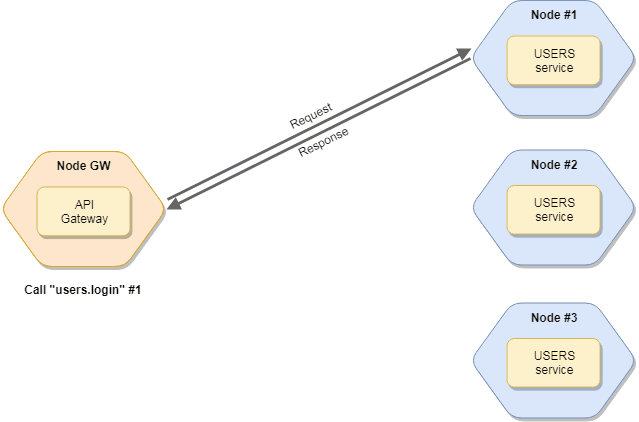
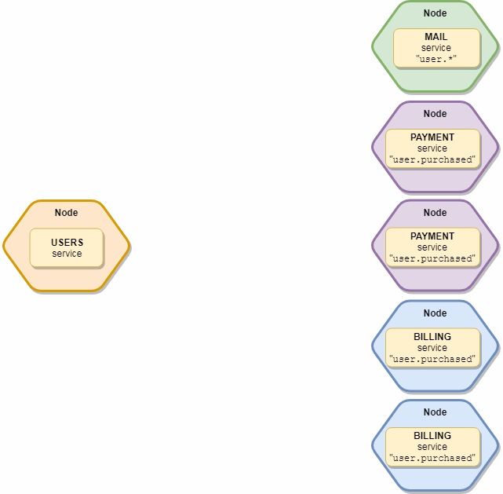

## Getting Started
### Install the Gem

```ruby
gem install "moleculer-ruby"
```

or add to your Gemfile:

```ruby
gem "moleculer-ruby", "~>0.3"
```

## The Service Broker
{include:Moleculer::Broker}

## Actions



{include:Moleculer::Broker::Actions}
### Call Services
{render_method:Moleculer::Broker::Actions#call}

## Events
{include:Moleculer::Broker::Events}

### Balanced Events
The event listeners are arranged to logical groups. It means that only one listener is triggered in every group.

> **Example:** you have 2 main services: `users` & `payments`. Both subscribe to the `user.created` event. You start 3 
> instances of users service and 2 instances of payments service. When you emit the `user.created` event, only one users
> and one payments service instance will receive the event.
  



The group name comes from the service name, but it can be overwritten in event definition in services.

**Example**

```ruby
class Payment < Moleculer::Service::Base
  event "order.created", :order_created, group: "other"
  
  def order_created(ctx)
    # ...
  end
end
```

#### Emit Balanced Events

{render_method:Moleculer::Broker::Events#emit}

